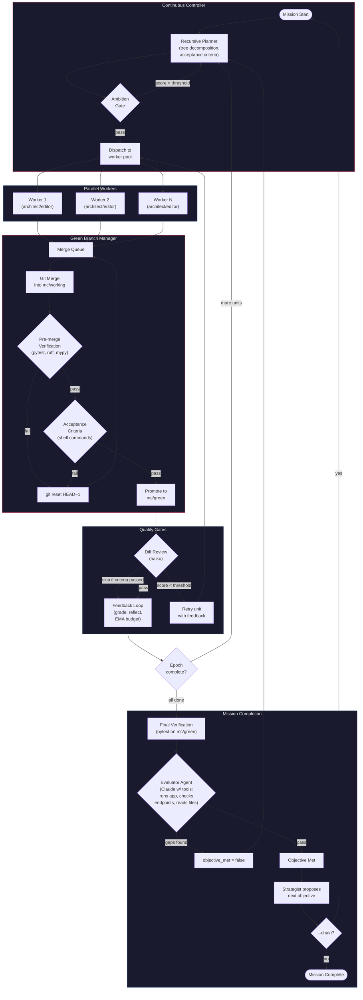

# autonomous-development

Autonomous dev daemon that continuously improves a codebase toward a "north star" objective. Spawns parallel Claude Code workers, manages state in SQLite, and learns from its own outcomes via an RL-style feedback loop.

Point it at a repo with an objective and a verification command. It plans, executes, merges, verifies, and pushes -- in a loop -- until the objective is met or it stalls. Then it auto-discovers the next objective and chains into a new mission.

## How it works



Each epoch:
1. **Plan** -- Recursive planner decomposes the objective into a tree of work units with executable acceptance criteria (shell commands), dependency ordering, and specialist assignments
2. **Ambition gate** -- Reject trivially scoped plans (configurable min score) and force replanning
3. **Execute** -- Parallel Claude workers run in isolated workspace clones, optionally using architect/editor two-pass mode
4. **Merge** -- Workers' branches queue into the merge queue and merge into `mc/working` via the green branch manager
5. **Pre-merge verification** -- pytest/ruff/mypy run on the merged code before accepting. Failures roll back the merge with `git reset --hard HEAD~1`
6. **Acceptance criteria** -- Shell commands from the planner (e.g. `pytest tests/test_auth.py -q`) run as a second gate. Failures roll back
7. **Fixup** -- If merge conflicts occur, N candidate fixup agents run in parallel; the best-scoring candidate wins
8. **Review gate** -- LLM diff review (haiku) scores each unit on alignment, approach, and tests. Skipped when acceptance criteria already passed
9. **Evaluator agent** -- At mission end, a Claude subprocess with shell/file access actually runs the software, checks endpoints, and inspects output. Flips `objective_met` to false if gaps are found
10. **Feedback** -- Record reflections, compute rewards, track costs via EMA budget tracking
11. **Strategize** -- Strategist proposes follow-up objectives; `--chain` auto-starts the next mission

## Quick start

```bash
# Clone and install
git clone git@github.com:dannywillowliu-uchi/autonomous-development.git
cd autonomous-development
uv venv && uv pip install -e .

# Configure (edit to point at your repo)
cp mission-control.toml.example mission-control.toml
# Edit: target.path, target.objective, target.verification.command

# Run a mission
.venv/bin/python -m mission_control.cli mission --config mission-control.toml --workers 2

# Run with auto-chaining (continues after objective is met)
.venv/bin/python -m mission_control.cli mission --config mission-control.toml --workers 2 --chain

# Live web dashboard
.venv/bin/python -m mission_control.cli live --config mission-control.toml --port 8080
```

## Configuration

All config lives in `mission-control.toml`:

```toml
[target]
name = "my-project"
path = "/path/to/repo"
branch = "main"
objective = "Add comprehensive test coverage for the auth module"

[target.verification]
command = "pytest -q && ruff check src/"
timeout = 120

[scheduler]
model = "opus"           # Model for all Claude subprocesses
session_timeout = 900    # Max seconds per worker session

[scheduler.budget]
max_per_session_usd = 5.0
max_per_run_usd = 100.0

[scheduler.parallel]
num_workers = 2          # Parallel Claude workers
pool_dir = "/tmp/mc-pool"

[rounds]
max_rounds = 20          # Max rounds before stopping
stall_threshold = 5      # Rounds with no improvement before stopping

[planner]
max_depth = 2            # Recursive decomposition depth
max_children_per_node = 5

[continuous]
max_wall_time_seconds = 3600
min_ambition_score = 4          # Reject trivial plans (1-10 scale)
max_replan_attempts = 2         # Replan attempts on ambition rejection
verify_objective_completion = true  # LLM verifies objective before declaring done
max_objective_checks = 2

[continuous]
verify_before_merge = true   # Pre-merge verification gate (default: on)

[review]
gate_completion = true       # Block low-quality units
min_review_score = 5.0       # Minimum average review score (1-10)
model = "haiku"              # Cheaper model for diff review
skip_when_criteria_passed = true  # Skip review when acceptance criteria passed

[evaluator]
enabled = false              # Opt-in: evaluator agent at mission end
model = "sonnet"             # Model for evaluator subprocess
budget_usd = 0.50            # Max cost per evaluation
timeout = 300                # Seconds before timeout
max_turns = 10               # Max agentic turns

[green_branch]
auto_push = true         # Push mc/green to main after each round
push_branch = "main"
fixup_max_attempts = 3
# fixup_candidates = 3   # N-of-M parallel fixup agents

[discovery]
enabled = true
tracks = ["feature", "quality", "security"]
research_enabled = true

[models]
planner = "opus"         # Model for planning calls
reviewer = "sonnet"      # Model for diff review
strategist = "opus"      # Model for objective proposal

[hitl]
enabled = false
gates = ["push", "large_merge"]  # Actions requiring approval
poll_timeout = 300               # Seconds to wait for approval
telegram = true                  # Use Telegram for approval prompts

[speculation]
enabled = false
branch_count = 3         # Parallel branches per uncertain unit
selection = "best_score" # How to pick the winner

[degradation]
enabled = true
failure_threshold = 5    # Failures before circuit opens
reset_timeout = 300      # Seconds before half-open retry
fallback_strategy = "simple"

[episodic_memory]
enabled = true
max_episodes = 100       # Max stored episodes per project
similarity_threshold = 0.7

[a2a]
enabled = false
host = "0.0.0.0"
port = 5000

[tracing]
enabled = false
endpoint = "http://localhost:4318"  # OTLP endpoint
service_name = "mission-control"
```

## Architecture

```
src/mission_control/                    # 57 modules
+-- __init__.py
+-- __main__.py
+-- cli.py                   # CLI entry point (16 commands)
+-- config.py                # TOML config loader + validation
+-- models.py                # Dataclasses (Mission, WorkUnit, Epoch, ...)
+-- db.py                    # SQLite with WAL mode + migrations
+-- continuous_controller.py # Main epoch loop with ambition/review gates
+-- continuous_planner.py    # Adaptive planner with replan-on-stall
+-- recursive_planner.py     # Tree decomposition of objectives
+-- worker.py                # Worker prompt rendering + architect/editor mode
+-- specialist.py            # Specialist worker template routing
+-- grading.py               # Deterministic decomposition grading
+-- evaluator.py             # Round scoring (test/lint delta, completion, regression)
+-- diff_reviewer.py         # LLM diff review (alignment/approach/tests scoring)
+-- reviewer.py              # Review gating logic
+-- feedback.py              # Reflections, rewards, experiences
+-- green_branch.py          # Green branch pattern + N-of-M fixup selection
+-- merge_queue.py           # Ordered merge queue for worker branches
+-- ema.py                   # Exponential moving average budget tracking
+-- memory.py                # Typed context store for workers
+-- session.py               # Claude subprocess spawning + output parsing
+-- strategist.py            # Follow-up objective proposal + mission chaining
+-- auto_discovery.py        # Gap analysis -> research -> backlog pipeline
+-- priority.py              # Backlog priority scoring + recalculation
+-- backlog_manager.py       # Persistent backlog across missions
+-- overlap.py               # File overlap detection + dependency injection
+-- causal.py                # Causal attribution for outcome analysis
+-- degradation.py           # Graceful degradation with circuit breakers
+-- circuit_breaker.py       # Circuit breaker state machine
+-- hitl.py                  # Human-in-the-loop approval gates (file + Telegram)
+-- a2a.py                   # Agent-to-Agent protocol server
+-- mcp_server.py            # MCP server for external control
+-- mcp_registry.py          # MCP tool registry
+-- tracing.py               # OpenTelemetry tracing integration
+-- tool_synthesis.py        # Dynamic tool generation for workers
+-- prompt_evolution.py      # Prompt variant evolution + scoring
+-- planner_context.py       # Mission state formatting for planner prompts
+-- mission_report.py        # Post-mission JSON report generation
+-- heartbeat.py             # Liveness monitoring + stale worker recovery
+-- notifier.py              # Telegram notifications with batching + retry
+-- event_stream.py          # SSE event stream for live dashboard
+-- token_parser.py          # Token usage tracking + cost estimation
+-- json_utils.py            # Robust JSON extraction from LLM output
+-- state.py                 # Mission state formatting
+-- launcher.py              # Subprocess launcher utilities
+-- constants.py             # Shared constants
+-- registry.py              # Multi-project registry
+-- workspace.py             # Git clone pool management
+-- dashboard/
|   +-- live.py              # FastAPI app for live web dashboard
|   +-- live_ui.html         # Dashboard frontend (SSE + real-time updates)
|   +-- tui.py               # Terminal UI
|   +-- provider.py          # Dashboard data provider
+-- backends/
|   +-- base.py              # WorkerBackend ABC
|   +-- local.py             # Local subprocess backend with workspace pool
|   +-- ssh.py               # Remote SSH backend
|   +-- container.py         # Container-based worker backend
```

## Key concepts

**Green branch pattern**: Workers merge into `mc/working` via a merge queue. A pre-merge verification gate (pytest/ruff/mypy) runs immediately after merge; failures roll back with `git reset --hard HEAD~1`. Executable acceptance criteria (shell commands from the planner) run as a second gate. Only code that passes both promotes (ff-merge) to `mc/green`.

**N-of-M fixup selection**: When verification fails, N=3 parallel fixup agents run with different approach hints. Each produces a candidate patch. The system selects the candidate with the best test delta, inspired by tournament-style patch selection from Agentless (UIUC).

**Architect/editor mode**: Workers optionally operate in two passes. Pass 1 (architect) analyzes the codebase and describes needed changes without editing. Pass 2 (editor) implements the architect's plan. Inspired by Aider's architect/editor pattern.

**Ambition gate**: The controller scores planned work units on ambition (1-10). Plans below the threshold are rejected and the planner is forced to replan with feedback, preventing trivially scoped busywork.

**Review gate**: After each unit completes, an LLM diff review scores it on alignment, approach quality, and test meaningfulness. Units below the threshold are retried with review feedback injected.

**Evaluator agent**: At mission end, a Claude subprocess with full tool access (shell, file reads) actually runs the software: executes tests, checks HTTP endpoints, inspects files. Replaces pure LLM opinion with environment-grounded verification. Disabled by default (opt in via `[evaluator] enabled = true`).

**Speculation branching**: High-uncertainty units fork into N parallel branches with different approach hints. A selection gate picks the winner based on test/lint scores, allowing the system to explore multiple strategies simultaneously.

**Graceful degradation**: Circuit breakers track failure rates per component. When tripped, the system falls back to simpler strategies (e.g., fewer workers, no architect pass) instead of failing outright.

**Human-in-the-loop (HITL)**: Configurable approval gates before push/merge operations. Supports file-based polling and Telegram-based approval prompts with configurable timeout.

**Agent-to-Agent (A2A)**: Protocol server for inter-agent communication, allowing external agents to submit work or query mission state.

**MCP server**: Model Context Protocol server for external tool integration, exposing mission control operations as MCP tools.

**Episodic memory**: Stores and retrieves past worker experiences for context injection into subsequent worker prompts, enabling learning from prior attempts.

**Prompt evolution**: Variant tracking and scoring for prompt optimization. Maintains a population of prompt variants, scores them on worker outcomes, and evolves toward higher-performing prompts.

**Tool synthesis**: Dynamic tool generation for specialized worker tasks, creating purpose-built tools from templates at runtime.

**Specialist templates**: Role-specific worker prompts (e.g., test writer, refactorer, security auditor) that shape worker behavior for different task types.

**Causal attribution**: Traces outcomes back to specific planning and execution decisions, feeding attribution signals into the feedback loop for improved future planning.

**Evaluator**: Round-level scoring combining test delta, lint delta, completion rate, and regression detection. Drives the stall detector and adaptive replanning.

**EMA budget tracking**: Per-cycle costs are tracked with exponential moving average (alpha=0.3) with outlier dampening and conservatism factor. Adaptive cooldown increases when costs exceed budget.

**Typed context store**: Workers produce structured context items (architecture notes, gotchas, patterns) stored in SQLite with scope-based filtering. Relevant items are selectively injected into subsequent worker prompts.

**Adaptive planning**: The recursive planner decomposes objectives into a tree of work units with acceptance criteria and dependencies. File overlap detection automatically adds dependency edges between units touching the same files.

**Auto-discovery**: Pipeline that analyzes the codebase for gaps, researches best practices, and populates a persistent backlog with prioritized improvement items. The backlog persists across missions.

**Mission chaining**: With `--chain`, after a mission completes, the strategist proposes the next objective and a new mission starts automatically. Combined with auto-discovery, the system can continuously improve a codebase without human intervention.

**Tracing**: OpenTelemetry integration for observability, emitting spans for planning, execution, merging, and verification phases.

**Live dashboard**: Real-time web dashboard showing mission state, worker status, merge activity, and cost tracking via Server-Sent Events.

**Workspace pool**: Parallel workers each get an isolated git clone from a pre-warmed pool. Clones are recycled between epochs.

## CLI commands

```bash
# Run a mission
mc mission --config mission-control.toml --workers 2 [--chain]

# Show current status
mc status --config mission-control.toml

# Show session history
mc history --config mission-control.toml

# Auto-discover improvements
mc discover --config mission-control.toml

# Initialize a mission-control config
mc init --config mission-control.toml

# Live web dashboard
mc live --config mission-control.toml --port 8080

# TUI dashboard
mc dashboard --config mission-control.toml

# View mission summary
mc summary --config mission-control.toml

# Multi-project registry
mc register --config mission-control.toml
mc unregister --config mission-control.toml
mc projects

# Start MCP server (stdio)
mc mcp --config mission-control.toml

# Start A2A protocol server
mc a2a --config mission-control.toml

# Validate config file
mc validate-config --config mission-control.toml

# Manage backlog priority queue
mc priority list --config mission-control.toml
mc priority set <item-id> <score>
mc priority defer <item-id>
mc priority import --file BACKLOG.md
mc priority recalc
mc priority export
```

## Tests

```bash
uv run pytest -q                           # 1,690+ tests
uv run ruff check src/ tests/              # Lint
uv run mypy src/mission_control --ignore-missing-imports  # Types
```

## Requirements

- Python 3.11+
- [Claude Code CLI](https://docs.anthropic.com/en/docs/claude-code) (`claude` command available)
- Claude Max or API key with sufficient budget
- Git
